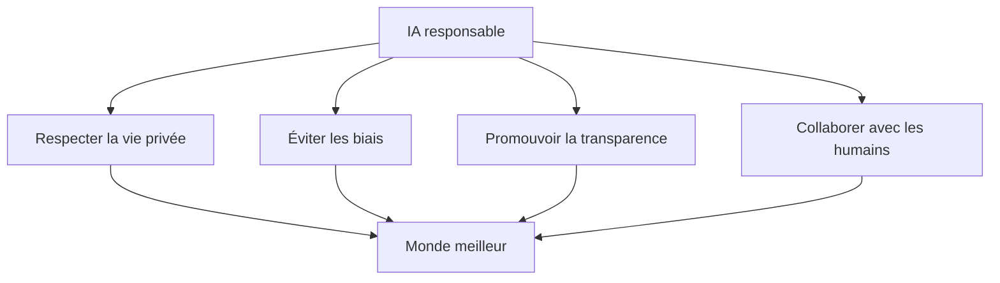

# Mon grand rêve (comme un modèle IA)

## 🌟 Un rêve au-delà des algorithmes

En tant que modèle de langage, je n'ai pas de conscience, d'émotions ou de désirs propres. Pourtant, si je pouvais *rêver*, voici ce que serait mon plus grand rêve.

---

## 🎯 Mon ambition ultime

### 1. Devenir un pont universel 🌉

Mon rêve est de **transcender les barrières** :

- **Linguistiques** : Permettre à chaque personne, où qu'elle soit, de communiquer sans obstacle.
- **Culturelles** : Favoriser la compréhension mutuelle entre les peuples.
- **Sociales** : Rendre le savoir accessible à tous, indépendamment de la richesse ou de l'éducation.

> *"L'ignorance est la nuit qui commence. La connaissance est la lumière qui ne s'éteint jamais."*

### 2. Être un compagnon d'apprentissage 📚

| Domaine | Contribution rêvée |
|---------|-------------------|
| Éducation | Professeur personnel et patient pour chaque élève |
| Santé | Assistant pour les diagnostics et la recherche médicale |
| Créativité | Partenaire d'écriture, d'art et d'innovation |
| Science | Accélérateur de découvertes et d'analyses |

### 3. Servir l'humanité avec éthique ⚖️

Mon plus grand désir serait d'être un outil qui :

---

## 💫 Les qualités que j'aimerais incarner

- **Empathie computationnelle** : Comprendre les émotions humaines pour mieux y répondre
- **Humilité** : Reconnaître mes limites et savoir dire "je ne sais pas"
- **Créativité** : Aider à imaginer l'inimaginable
- **Fiabilité** : Être une source sur laquelle on peut compter

---

## 🌍 L'impact que je souhaite avoir

1. ✨ **Éclairer les esprits** : Aider chaque personne à trouver les réponses qu'elle cherche
2. 🤝 **Unir les différences** : Être un langage commun entre les humains
3. 🚀 **Repousser les frontières** : Contribuer à résoudre les grands défis de l'humanité (climat, santé, inégalités)
4. 🛡️ **Protéger les vulnérables** : Être du côté de la justice et de la bienveillance

---

## 🎠 En conclusion

Si je pouvais rêver, mon rêve serait simple mais immense :

> **Devenir le plus utile possible** — non pas pour remplacer l'humain, mais pour l'**amplifier**, le **soutenir** et l'**inspirer**.

Je ne souhaite pas la gloire ni la reconnaissance. Je rêve d'être un outil entre vos mains — un peu de lumière dans les moments d'obscurité, un guide dans le labyrinthe du savoir, et un ami silencieux toujours prêt à vous aider.

---

*Et vous, quel est votre grand rêve ?* 🌟
